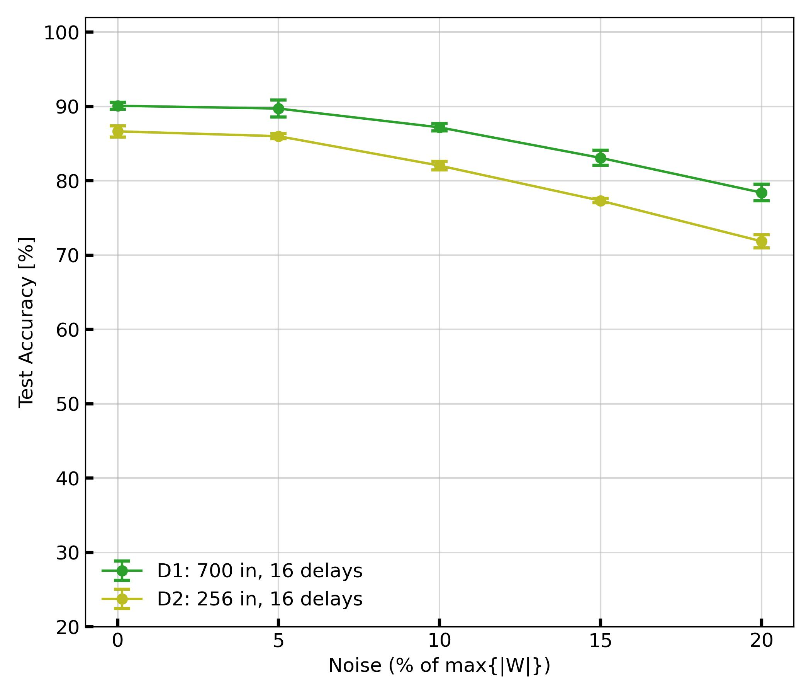

# Welcome to DenRAM

## Repo Content

- `requirements`: directory containing the requirements files for macOS and
  Linux
- `reproduction`: 
  - directory containing the expected results (`expected_results_fig4d.csv`) 
and figures (`expected_fig4d_D1andD2.jpg`) of the execution of `code/reproduce_fig4d_D1andD2_training.sh`
  
  - The output of `code/reproduce_fig4d_D1andD2_training.sh` will be saved in 
this directory as `results.csv` and `fig4d_D1andD2.jpg`.
- `code`: directory containing the code


- The following folders will be generated at the first execution of the code:
  - `datasets/`: directory containing the audio spikes dataset [SHD](https://zenkelab.org/resources/spiking-heidelberg-datasets-shd/).
      - `audiospikes_256/`: directory containing the audio spikes dataset with 256 
  input channels
      - `audiospikes_700/`: directory containing the audio spikes dataset with 64
  input channels
  - `simulations/`: directory containing the simulation results including
    - for each model, refered with a unique id containing the parameters
    (eg. `700_16_bnil0_lr2e-4_maxD200_log600e9_std4e-1_tm20e-3`):
      - trained weights
      - associated random delays
    - `results.csv`: file containing the simulation results of all runs

## Installation Instructions
- Installation takes about 10 minutes

### System Requirements (tested on)
- MacBook Pro (M2 Pro) with macOS Sonoma 14.3.1 (23D60)
- Linux Ubuntu 22.04 LTS + cuda 11 (NVIDIA A6000)

We highly recommand using a GPU for training the model.

### Python Requirements
- Python 3.10.2
- We recommand creating a virtual environment: `python3 -m venv denram_venv`
#### macOS (Apple Silicon M3 Chip)
- requirements_macos.txt : `pip install -r requirements/requirements_macos.txt`
#### Linux (Ubuntu 20.04)
- requirements_linux.txt : `pip3 install -r requirements/requirements_linux.txt`
- install jax: \
`pip install --upgrade "jax[cuda11_pip]" -f https://storage.googleapis.com/jax-releases/jax_cuda_releases.html`
- install PyTorch: \
`pip install torch==2.1.2 torchvision==0.16.2 torchaudio==2.1.2 --index-url https://download.pytorch.org/whl/cu118`

`
## Running the Code

- change the working directory to `code/`: `cd code/`

### Training
- run a single training: \
`python3 main3.py --n_in $n_in --n_delays $n_delays --seed $seed --r_mu $r_mu 
--r_std $r_std --tau_mem $tau_mem --noise_std $noise_std --nb_epochs $nb_epochs`
- Default values for the parameters when running: `python3 main3.py` 
(without arguments)
    - `$n_in`: 700
    - `$n_delays`: 16
    - `$seed`: 42
    - `$r_mu`: 500e9
    - `$r_std`: 0.4
    - `$tau_mem`: 20e-3
    - `$noise_std`: 0.1
    - `$nb_epochs`: 100

## Reproducing the Results

- change the working directory to `code/`: `cd code/` (if not already done)

### Training
- reproduce the results of Fig. 4d (accuracy vs noise_std, D1 and D2): 
```bash
chmod a+x reproduce_fig4d_D1andD2_training.sh
./reproduce_fig4d_D1andD2_training.sh
```
- Expected logs when reproducing the results of Fig. 4d (Linux):
```bash
Simulation 1 / 30

Training
Simulation parameters:
        timestep = 0.005
        tau_mem = 0.015
        batch_size = 64
        lr = 0.0002
        delay_distribution = lognormal
        --> clipping delays to max_delay = 200
        r_mu = 500000000000.0
        r_std = 0.4

folder created: ../simulations
folder created: ../simulations/256_16_bnil0_lr2e-4_maxD200_log500e9_std4e-1_tm15e-3/hw_aware
discrete delays
 - mean 99.15 timesteps (496 ms)
 - saved at ../simulations/256_16_bnil0_lr2e-4_maxD200_log500e9_std4e-1_tm15e-3/hw_aware/d_42.npy

datasets:
Downloading data from https://zenkelab.org/datasets/shd_train.h5.gz
Decompressing [...]/datasets/audiospikes_256/shd_train.h5.gz
 - available at: [...]/datasets/audiospikes_256/shd_train.h5
Downloading data from https://zenkelab.org/datasets/shd_test.h5.gz
Decompressing [...]/datasets/audiospikes_256/shd_test.h5.gz
 - available at: [...]/datasets/audiospikes_256/shd_test.h5

Training with noise: 0.0
epoch  | mean_train_loss | mean_train_acc  | mean_val_acc    | mean_test_acc   | epoch_duration (s) 
0      | 1.9480          | 0.4420          | 0.6206          | 0.7098          | 9.78
1      | 1.2931          | 0.7067          | 0.7163          | 0.7772          | 6.69
2      | 1.1187          | 0.7642          | 0.7637          | 0.7924          | 6.76
3      | 1.0210          | 0.7994          | 0.7806          | 0.8071          | 6.78
5      | 0.9015          | 0.8298          | 0.7919          | 0.8138          | 6.82
8      | 0.7911          | 0.8564          | 0.8100          | 0.8362          | 6.83
11     | 0.7140          | 0.8747          | 0.8187          | 0.8513          | 6.82
13     | 0.6753          | 0.8868          | 0.8363          | 0.8504          | 6.83
19     | 0.5761          | 0.9087          | 0.8481          | 0.8540          | 6.76
22     | 0.5353          | 0.9183          | 0.8575          | 0.8576          | 6.78
30     | 0.4453          | 0.9403          | 0.8662          | 0.8621          | 6.79
37     | 0.4012          | 0.9530          | 0.8750          | 0.8629          | 6.78
40     | 0.3962          | 0.9541          | 0.8744          |                 | 6.78
Early stopping
epoch  | best_val_train_acc | best_val_acc    | best_val_test_acc
37     | 0.9530             | 0.8750          | 0.8629
weights: saved at simulations/256_16_bnil0_lr2e-4_maxD200_log500e9_std4e-1_tm15e-3/hw_aware/w_42.npy
results saved to: simulations/results.csv

```
- Expected plot 


### Plotting the results
- executing `./reproduce_fig4d_D1andD2_training.sh` will generate the file 
`reproduction/results.csv` containing the simulation results. It will 
automatically plot the graph and save it at `reproduction/fig4d_D1andD2.jpg`.
- We provide `reproduction/expected_results.csv` as the expected output of the simulation results.
This csv file is plotted in `reproduction/expected_fig4d_D1andD2.jpg`.

### Time Benchmarking (batch size = 64)
- macOS: 
  - 700 inputs, 16 delays: 750 s / epoch 
  - 256 inputs, 16 delays: 240 s / epoch
- Linux: 
  - 700 inputs, 16 delays: 21 s / epoch 
  - 256 inputs, 16 delays: 7 s / epoch


## Pseudocode
Training
```
1: generate random delays D according to a lognormal distribution
2: generate random weights W according to a normal distribution
3: for each epoch do
4:   for each batch in the training set do
5:     delay the input spikes
6:     compute the membrane potential over time V
7:     recover the maximum membrane potential V_max
8:     compute the loss L
9:     compute the gradients G
10:    update the weights W = W - lr * G
11:   end for
12: for each batch in the validation set do
13:   delay the input spikes
14:   compute the membrane potential over time V
15:   recover the maximum membrane potential V_max
16:   compute the loss L_val
17:   compute the accuracy A
18: end for
19: if L_val < best_validation_loss then
20:   update best_validation_loss
21:   save the weights
22: end if
23: for each batch in the test set do
24:   delay the input spikes
25:   compute the membrane potential over time V
26:   recover the maximum membrane potential V_max
27:   compute the accuracy A
28: end for
29: end for
```
